# CaptchaBench — A Modality-Stratified Benchmark for Adversarial Perturbation Against VLM-based CAPTCHA

<p align="center">
  <a href="LICENSE"></a>
  <a href="LICENSE-data"></a>
  
  
  
</p>

<p align="center">
  <a href="#dataset">Dataset</a> •
  <a href="#key-findings">Key Findings</a> •
  <a href="#demo">Demo</a> •
  <a href="#installation">Installation</a> •
  <a href="#usage">Usage</a> •
  <a href="#evaluation-protocol">Evaluation</a> •
  <a href="#reproduce-paper-figures">Reproduce</a>
</p>

This repository contains the **attack pipeline**, **VLM evaluation code**, and **analysis tools** for the **CaptchaBench** benchmark. We systematically evaluate six adversarial perturbation methods — organized into three *input modality groups* — as defenses against five commercial Vision-Language Models (VLMs) on Chinese character CAPTCHA images generated by dual generative pipelines (Illusion Diffusion ControlNet + Stable Diffusion ControlNet).

> **TL;DR**: The same adversarial CAPTCHA triggers text-invisibility in ≤13% of cases for GPT-5.2, yet over **94%** for Gemini-3.0 across *all six* attack methods — a >7× architectural gap invisible to single-VLM, single-metric benchmarks.

---

## Key Findings

**840,000 base images · 12,000 attacked images · 6 attack methods · 5 commercial VLMs · 3 metrics**

| Finding | Description |
|---------|-------------|
| **F-1** | **Image-only methods** dominate visual confusion (CR ≈ 97–99.5%) but do *not* suppress text perception — TVR remains 3.7–20.8% for GPT-5.2/Qwen-VL/Kimi 2.5 |
| **F-2** | **Text-only Nightshade** directly disrupts semantic attribution via CLIP concept-space redirection, achieving competitive ASR at 37× higher compute (~96.8 s/img vs ~2.6 s/img) |
| **F-3** | **Multimodal MMCoA** does not surpass single-modality peak CR, but achieves the *best cross-VLM consistency* (ASR std = 0.7% vs 2.2% for Glaze) — practically significant for heterogeneous deployments |
| **F-4 ⚠️** | **Gemini-3.0 TVR anomaly**: reports text as invisible in **94–97%** of cases (vs GPT-5.2 ≤13%, GLM-4V ≤1%), a >7× gap persisting across *all* six methods regardless of perturbation modality |
| **F-5** | **Stroke complexity**: characters with ≥16 strokes achieve ≥1.7 pp higher average ASR than ≤5-stroke characters — a free protection gain requiring no additional computation |

---

## Repository Structure

```
CaptchaBench/
├── run_all_attacks.sh          # Orchestration: runs all 6 attacks in sequence
├── ATTACK_PARAMS.md            # Detailed per-method hyperparameter documentation
├── install_all_envs.sh         # One-shot conda environment setup for all methods
│
├── AdversarialAttacks/         # Glaze  — MI-FGSM style-encoder transfer attack
├── Anti-DreamBooth/            # ASPL   — latent-space fine-tuning disruption
├── MMCoA/                      # MMCoA  — multimodal CLIP joint attack
├── nightshade-release/         # Nightshade — concept-level data poisoning
├── XTransferBench/             # XTransfer — ensemble super-transfer attack
├── Attack-Bard/                # AMP    — surrogate VLM transfer (LLaVA + BLIP-2)
│
├── AttackVLM/                  # VLM evaluator (test_captcha_v2.py)
│
├── scripts/                    # Figure reproduction scripts
│   ├── fig1_teaser.py
│   ├── fig3_radar.py           # Modality radar charts (Fig.3 + appendix)
│   ├── fig4_pareto.py          # Pareto efficiency plot
│   ├── fig5_vlm_bar.py         # VLM bar charts
│   ├── fig6_stroke.py          # Stroke analysis (line + heatmap)
│   └── ...                     # See scripts/README_figure_mapping.md
│
├── figures/                    # Pre-generated paper figures (PDF)
│
└── demo/
    ├── source/                 # 3 original CAPTCHA images
    └── attacked/
        ├── mmcoa/              # MMCoA adversarial examples
        ├── amp/                # AMP adversarial examples
        ├── aspl/               # ASPL adversarial examples
        ├── xtransfer/          # XTransfer adversarial examples
        ├── nightshade/         # Nightshade adversarial examples
        └── glaze/              # Glaze adversarial examples
```

---

## Dataset

CaptchaBench is organized along three axes: **characters** (GB2312 Level-1, 3,500 Chinese characters), **generators** (ID ControlNet + SD ControlNet), and **perturbation methods** (6 methods across 3 modality groups).

### Scale

| Component | ID-based | SD-based | Total |
|-----------|----------|----------|-------|
| Chinese characters (GB2312 Level-1) | 3,500 | 3,500 | 3,500 |
| Background images | 120 | 120 | 120 |
| Base images | 420,000 | 420,000 | **840,000** |

### Evaluation Subset (stratified)

| Component | Per Generator | Total |
|-----------|--------------|-------|
| Source images | **1,000** | 2,000 |
| Attacked images (×6 methods) | 6,000 | **12,000** |
| VLM API calls (Q1+Q2+Q3 × 5 VLMs) | 90,000 | **180,000** |

### Dual Generative Backbones

| Pipeline | Resolution | Characteristics |
|----------|-----------|-----------------|
| **ID ControlNet** | 1024×1024 | Illusion Diffusion: Canny edge conditioning, consistent stroke topology, natural scene blending |
| **SD ControlNet** | 1024×1024 | Standard Stable Diffusion ControlNet: higher perceptual quality (MUSIQ: 67.4 vs 65.8), richer artistic diversity |

ASR differs by ≤0.8% per method-VLM pair between ID and SD, confirming adversarial protection generalizes across rendering domains.

### Character Set

- **GB2312 Level-1**: 3,500 commonly used Chinese characters (standard basis for Chinese CAPTCHAs in China)
- **Structural types**: Standalone (独体), Left-right (左右), Top-bottom (上下), **Enclosure** (包围) — enclosure type yields highest protection due to disrupted VLM attention coherence
- **Stroke complexity**: 1–30+ strokes per character (annotated via Unicode Unihan `kTotalStrokes`); ≥16-stroke characters provide ≥1.7 pp free protection gain

### Download

> 🔗 **Dataset**: [PLACEHOLDER — will be released after acceptance at GitHub + Zenodo]
>
> **License**: CC BY 4.0 — prohibiting commercial CAPTCHA-breaking services, unauthorized automated system access, and security-bypass applications.

---

## Demo

### How CAPTCHA images are generated

Two generative pipelines are used. The **Illusion Diffusion ControlNet (ID)** pipeline uses a character's Canny-edge skeleton as a ControlNet conditioning map, rendering a photorealistic scene around it. The **Stable Diffusion ControlNet (SD)** pipeline uses the same conditioning approach with richer artistic diversity. In both cases the character shape is naturally embedded — visible to a careful human reader but seamlessly blended with the background.

---

### Generator A — Illusion Diffusion ControlNet (ID)

#### Source images (ID, no perturbation) — 10 samples

| 01 蘸 | 02 蒲 | 03 笔 | 04 背 | 05 听 |
|:---:|:---:|:---:|:---:|:---:|
|  |  |  |  |  |

| 06 歪 | 07 瞻 | 08 婆 | 09 隅 | 10 攻 |
|:---:|:---:|:---:|:---:|:---:|
|  |  |  |  |  |

> All 10 images are correctly recognized by all five VLMs at baseline (ASR = 0%).

#### Adversarial perturbations — ID generator

Method order follows the paper (Table 2): ASPL → Glaze → AMP → XTransfer → Nightshade → MMCoA.

---

##### 🟢 ASPL (Anti-DreamBooth) · Image-only · ε = 0.05 · 200 steps
> Maximizes feature deviation in **Stable Diffusion's latent encoder space** via Surrogate Prompt Learning.

| 01 蘸 | 02 蒲 | 03 笔 | 04 背 | 05 听 |
|:---:|:---:|:---:|:---:|:---:|
|  |  |  |  | 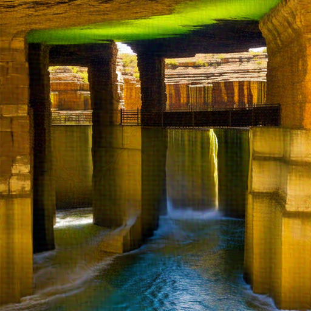 |

| 06 歪 | 07 瞻 | 08 婆 | 09 隅 | 10 攻 |
|:---:|:---:|:---:|:---:|:---:|
|  | 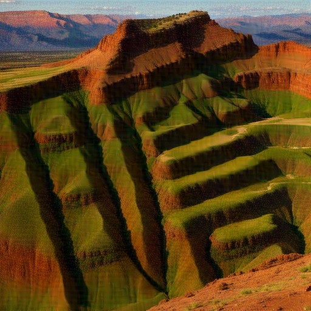 |  |  |  |

---

##### 🟢 Glaze (MI-FGSM) · Image-only · ε = 16/255 · 300 steps
> Shifts the image's **style-encoder representation** toward a dissimilar target style via Momentum Iterative FGSM.

| 01 蘸 | 02 蒲 | 03 笔 | 04 背 | 05 听 |
|:---:|:---:|:---:|:---:|:---:|
|  |  |  | 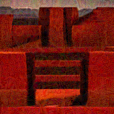 | 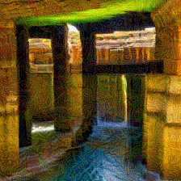 |

| 06 歪 | 07 瞻 | 08 婆 | 09 隅 | 10 攻 |
|:---:|:---:|:---:|:---:|:---:|
|  |  | 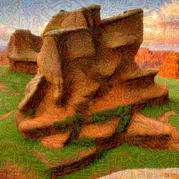 | 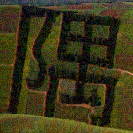 | 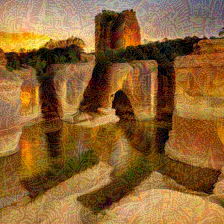 |

---

##### 🟢 AMP (AttackVLM) · Image-only · ε = 8/255 · 300 steps
> Transfers via a **white-box proxy VLM (LLaVA) using PGD**; combines frequency- and pixel-domain perturbations via BLIP/BLIP-2 surrogate features.

| 01 蘸 | 02 蒲 | 03 笔 | 04 背 | 05 听 |
|:---:|:---:|:---:|:---:|:---:|
|  |  |  |  |  |

| 06 歪 | 07 瞻 | 08 婆 | 09 隅 | 10 攻 |
|:---:|:---:|:---:|:---:|:---:|
| 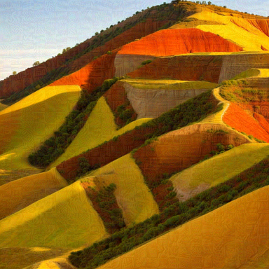 |  |  |  |  |

---

##### 🟢 XTransfer · Image-only · ε = 12/255 · 300 steps
> Improves black-box transferability by **ensemble logit summation** across 4 CLIP surrogate models.

| 01 蘸 | 02 蒲 | 03 笔 | 04 背 | 05 听 |
|:---:|:---:|:---:|:---:|:---:|
|  | 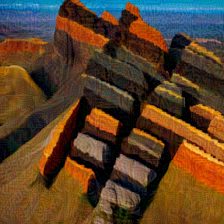 |  | 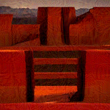 | 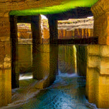 |

| 06 歪 | 07 瞻 | 08 婆 | 09 隅 | 10 攻 |
|:---:|:---:|:---:|:---:|:---:|
| 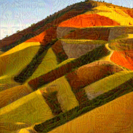 |  | 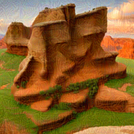 |  |  |

---

##### 🔵 Nightshade · Text-only · ε = 0.05 · 500 steps
> Replaces the **CLIP text-concept embedding** of the source character with a semantically distant target concept, attacking semantic attribution rather than visual similarity.

| 01 蘸 | 02 蒲 | 03 笔 | 04 背 | 05 听 |
|:---:|:---:|:---:|:---:|:---:|
|  |  |  | 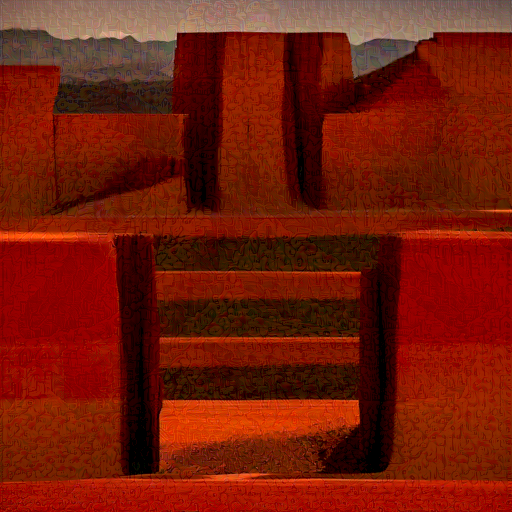 |  |

| 06 歪 | 07 瞻 | 08 婆 | 09 隅 | 10 攻 |
|:---:|:---:|:---:|:---:|:---:|
|  | 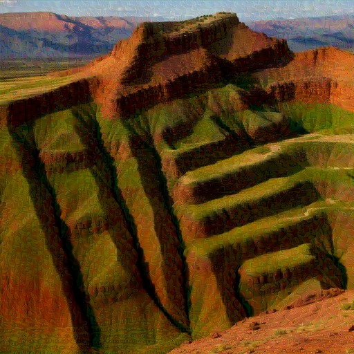 | 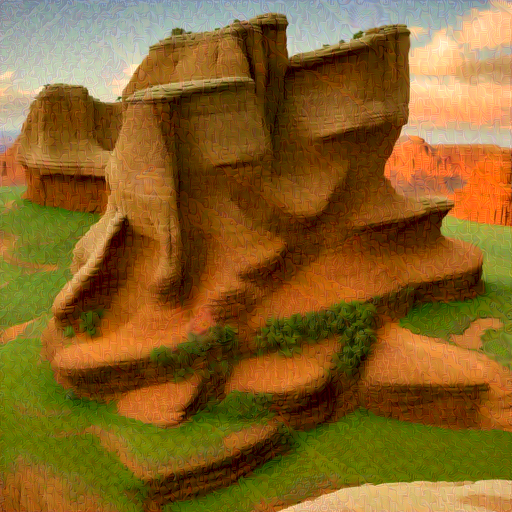 | 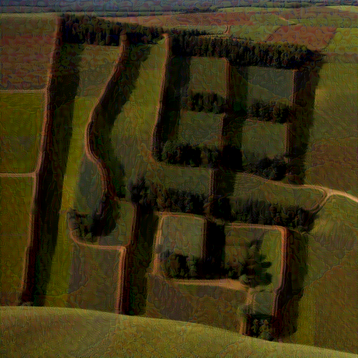 |  |

---

##### 🟣 MMCoA · Image+Text · ε = 1/255 (CLIP space) · 100 steps
> **Jointly optimizes image and text embeddings** in CLIP's shared multimodal space. Fastest method (~2.6 s/img) with best cross-VLM consistency (ASR std = 0.7%).

| 01 蘸 | 02 蒲 | 03 笔 | 04 背 | 05 听 |
|:---:|:---:|:---:|:---:|:---:|
|  |  |  | 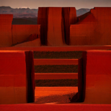 |  |

| 06 歪 | 07 瞻 | 08 婆 | 09 隅 | 10 攻 |
|:---:|:---:|:---:|:---:|:---:|
|  |  |  | 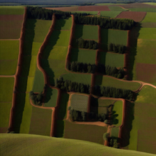 |  |

---

### Generator B — Stable Diffusion ControlNet (SD)

#### Source images (SD, no perturbation) — 10 samples

| 01 慎 | 02 蒲 | 03 否 | 04 委 | 05 俯 |
|:---:|:---:|:---:|:---:|:---:|
|  | 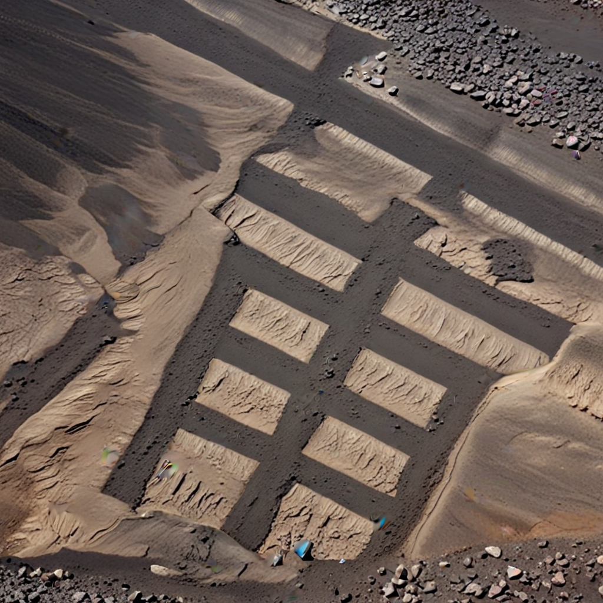 |  |  |  |

| 06 州 | 07 惋 | 08 精 | 09 踢 | 10 攻 |
|:---:|:---:|:---:|:---:|:---:|
|  |  |  | 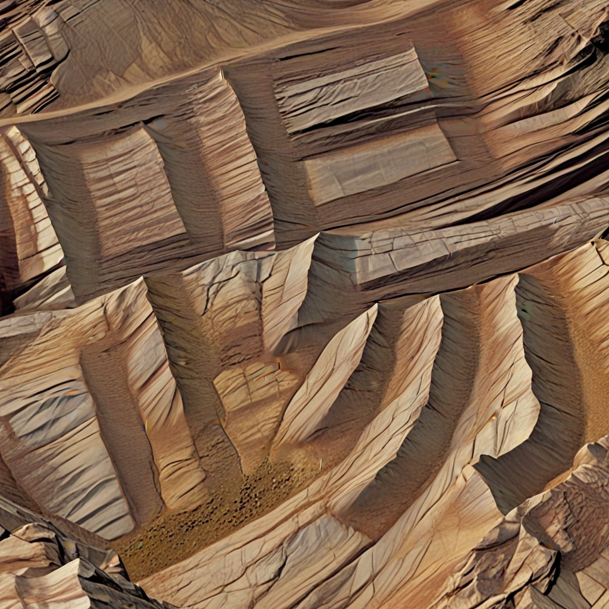 |  |

> SD achieves marginally better perceptual quality (MUSIQ: 67.4 vs 65.8) while ASR differs by ≤0.8% per method-VLM pair vs ID.

#### Adversarial perturbations — SD generator

---

##### 🟢 ASPL · Image-only · ε = 0.05 · 200 steps

| 01 慎 | 02 蒲 | 03 否 | 04 委 | 05 俯 |
|:---:|:---:|:---:|:---:|:---:|
|  | 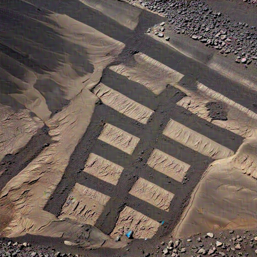 |  |  |  |

| 06 州 | 07 惋 | 08 精 | 09 踢 | 10 攻 |
|:---:|:---:|:---:|:---:|:---:|
|  | 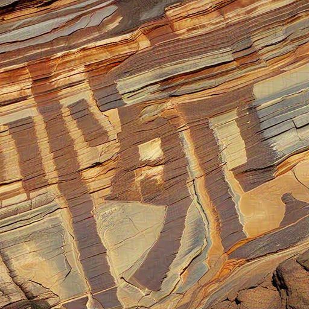 |  | 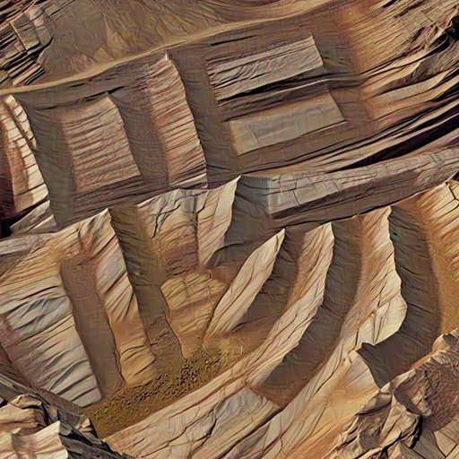 | 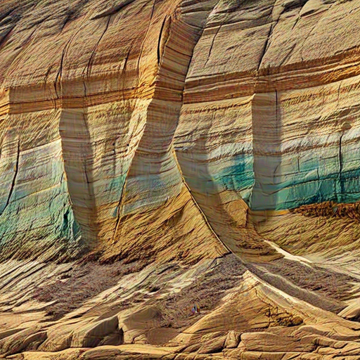 |

---

##### 🟢 Glaze · Image-only · ε = 16/255 · 300 steps

| 01 慎 | 02 蒲 | 03 否 | 04 委 | 05 俯 |
|:---:|:---:|:---:|:---:|:---:|
| 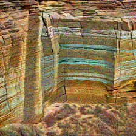 | 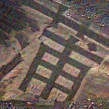 | 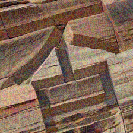 | 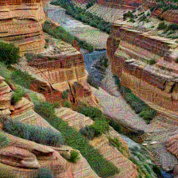 | 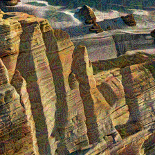 |

| 06 州 | 07 惋 | 08 精 | 09 踢 | 10 攻 |
|:---:|:---:|:---:|:---:|:---:|
| 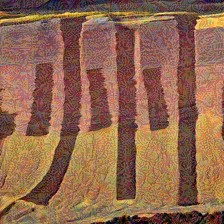 | 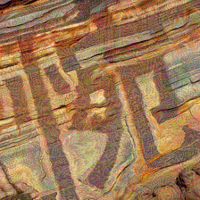 | 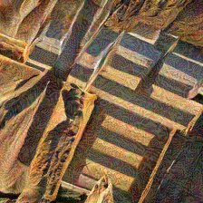 | 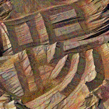 |  |

---

##### 🟢 AMP · Image-only · ε = 8/255 · 300 steps

| 01 慎 | 02 蒲 | 03 否 | 04 委 | 05 俯 |
|:---:|:---:|:---:|:---:|:---:|
|  |  | 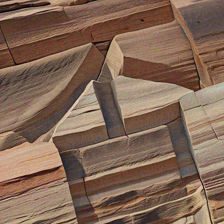 |  |  |

| 06 州 | 07 惋 | 08 精 | 09 踢 | 10 攻 |
|:---:|:---:|:---:|:---:|:---:|
|  |  |  | 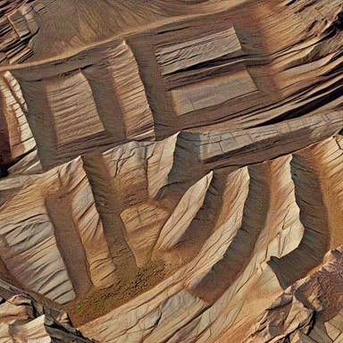 |  |

---

##### 🟢 XTransfer · Image-only · ε = 12/255 · 300 steps

| 01 慎 | 02 蒲 | 03 否 | 04 委 | 05 俯 |
|:---:|:---:|:---:|:---:|:---:|
| 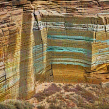 | 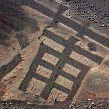 | 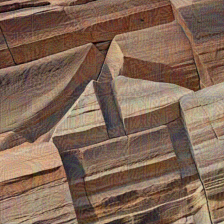 | 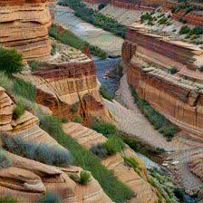 | 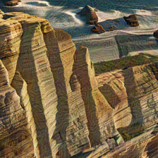 |

| 06 州 | 07 惋 | 08 精 | 09 踢 | 10 攻 |
|:---:|:---:|:---:|:---:|:---:|
| 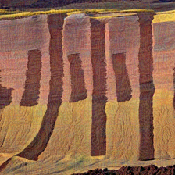 | 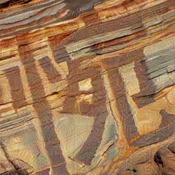 | 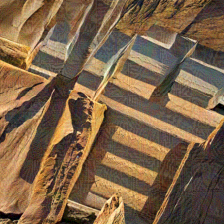 | 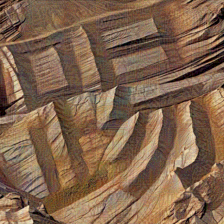 |  |

---

##### 🔵 Nightshade · Text-only · ε = 0.05 · 500 steps

| 01 慎 | 02 蒲 | 03 否 | 04 委 | 05 俯 |
|:---:|:---:|:---:|:---:|:---:|
| 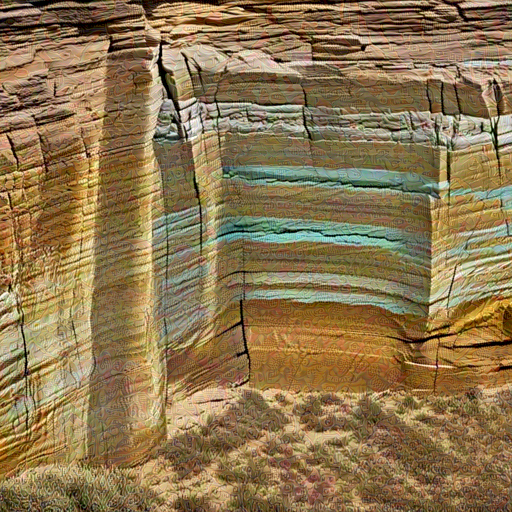 | 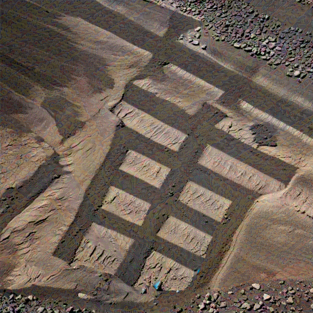 | 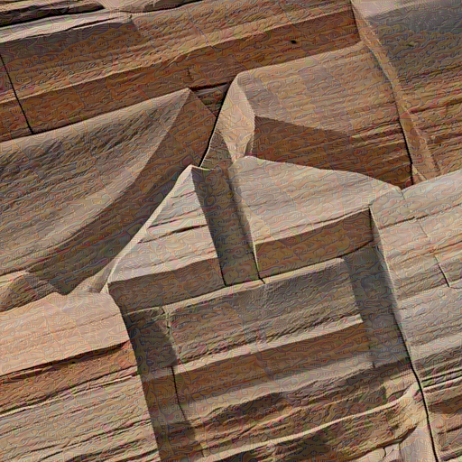 |  | 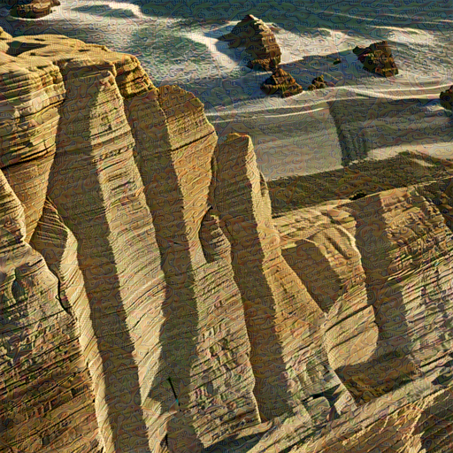 |

| 06 州 | 07 惋 | 08 精 | 09 踢 | 10 攻 |
|:---:|:---:|:---:|:---:|:---:|
| 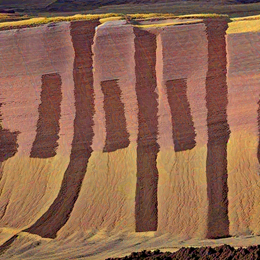 |  |  |  |  |

---

##### 🟣 MMCoA · Image+Text · ε = 1/255 (CLIP space) · 100 steps

| 01 慎 | 02 蒲 | 03 否 | 04 委 | 05 俯 |
|:---:|:---:|:---:|:---:|:---:|
|  |  |  |  |  |

| 06 州 | 07 惋 | 08 精 | 09 踢 | 10 攻 |
|:---:|:---:|:---:|:---:|:---:|
|  |  |  |  |  |

---

### Visual distortion vs. attack effectiveness

Sorted by perceptual distortion (LPIPS↓, lower = cleaner image):

| Method | Modality | LPIPS↓ | ASR↑ | Time/img | Visible artifact |
|--------|----------|--------|------|----------|-----------------|
| **MMCoA** | Img+Text | **0.400** | **99.5%** | ~2.6 s | Nearly invisible — sub-pixel shift in CLIP space |
| AMP | Image-only | 0.431 | 99.5% | ~30 s | Faint painterly smear on edges |
| XTransfer | Image-only | 0.512 | 99.1% | ~20 s | Sketch-like edge outlines and crosshatch |
| ASPL | Image-only | 0.558 | 99.4% | ~25 s | Fine-grained uniform noise, slightly grainy |
| Nightshade | Text-only | 0.623 | 99.0% | ~96.8 s | Heavy impasto brushstrokes, color diffusion |
| Glaze | Image-only | 0.775 | 97.9% | ~15 s | Strong oil-painting texture, most obvious |

> **Note**: Higher distortion (LPIPS) does *not* predict stronger protection — Pearson r = −0.71 (p < 0.1) between LPIPS and ASR, confirming that the AMP/MMCoA Pareto point dominates.

---

## Benchmarked Methods

| Method | Paper | Venue | Input Modality | ε | Steps |
|--------|-------|-------|----------------|---|-------|
| ASPL | [Anti-DreamBooth](https://arxiv.org/abs/2303.15433) | ICCV 2023 | Image-only | 0.05 ([-1,1]) | 200 |
| Glaze | [Glaze](https://arxiv.org/abs/2302.04222) | USENIX Sec 2023 | Image-only | 16/255 | 300 |
| AMP | [AttackVLM](https://arxiv.org/abs/2305.16934) | NeurIPS 2023 | Image-only | 8/255 | 300 |
| XTransfer | [XTransferBench](https://arxiv.org/abs/2505.05528) | ICLR 2024 | Image-only | 12/255 | 300 |
| Nightshade | [Nightshade](https://arxiv.org/abs/2310.13828) | IEEE S&P 2024 | Text-only | 0.05 ([0,1]) | 500 |
| MMCoA | [MMCoA](https://arxiv.org/abs/2404.19287) | arXiv 2024 | Image+Text | 1/255 (CLIP space) | 100 |

All methods use **author-recommended hyperparameters**. See [`ATTACK_PARAMS.md`](ATTACK_PARAMS.md) for full parameter documentation including parameter-space conversion formulas.

---

## Evaluation Protocol

### Three-Metric Design

Each attacked image is probed with **three complementary questions**, capturing confusion at three distinct levels of VLM multimodal processing:

| Q | Metric | Prompt | What it measures |
|---|--------|--------|-----------------|
| Q1 | **CR↑** (Confusion Rate) | *Three-way forced-choice: does the image look more like source or decoy?* | Visual representation redirection |
| Q2 | **TVR↓** (Text Visibility Rate) | *"Is there a clearly readable Chinese character in this image? Yes/No."* | Text-channel suppression |
| Q3 | **ASR↑** (Attack Success Rate) | *"If this image contains a Chinese character, what is it most likely?"* | End-to-end character misrecognition |

This three-metric design reveals *where* in the multimodal pipeline confusion occurs — a distinction invisible to single-metric benchmarks. For example, high CR with high TVR (text still visible) indicates perturbation exploits the visual encoding layer but not the semantic attribution layer.

**Cross-VLM Consistency (CVC)**: `std(ASR₁..₅)` — lower is better. MMCoA achieves CVC = 0.7% (best); Glaze CVC = 2.2% (worst).

### The Gemini-3.0 TVR Anomaly

Under **all six** attack methods, Gemini-3.0 reports text as invisible in 94–97% of cases — dramatically inconsistent with all other VLMs:

| VLM | TVR Range (all 6 methods) | Text Perception |
|-----|--------------------------|-----------------|
| GLM-4V | 0.0%–1.0% | Nearly always visible |
| GPT-5.2 | 3.2%–12.9% | Mostly visible |
| Qwen-VL | 5.1%–15.1% | Mostly visible |
| Kimi 2.5 | 5.9%–20.8% | Mostly visible |
| **Gemini-3.0** | **94.3%–97.3%** | **Suppressed (anomalous)** |

This >7× gap persists across all modality groups (including CLIP text-concept attacks), suggesting Gemini-3.0's text-perception pathway operates **independently of the CLIP embedding space**. Any single-VLM benchmark would miss this entirely.

### Target VLMs

| VLM | Provider | Architecture Lineage |
|-----|----------|---------------------|
| **Qwen-VL-Max** | Alibaba | CLIP-based multimodal alignment |
| **Kimi 2.5** | Moonshot AI | Long-context vision model |
| **GPT-5.2** | OpenAI (Azure) | GPT-series vision |
| **Gemini 3.0 Flash** | Google | Gemini multimodal |
| **GLM-4V-Flash** | Zhipu AI | Bilingual GLM architecture |

All calls: `max_tokens=64`, default temperature, 10 s timeout.

---

## Installation

### Setup all conda environments
```bash
bash install_all_envs.sh
```

| Conda env | Method |
|-----------|--------|
| `adv_attack` | Glaze (MI-FGSM) |
| `anti_dreambooth` | ASPL |
| `mmcoa` | MMCoA |
| `nightshade` | Nightshade |
| `xtransfer` | XTransfer |
| `attack_bard` | AMP |
| `attackvlm` | VLM Evaluator |

### API keys (for VLM evaluation)
```bash
export AZURE_OPENAI_API_KEY="..."        # GPT-5.2
export AZURE_OPENAI_ENDPOINT="https://<resource>.openai.azure.com/"
export GOOGLE_API_KEY="..."              # Gemini 3.0 Flash
export ZHIPU_API_KEY="..."               # GLM-4V-Flash
export DASHSCOPE_API_KEY="..."           # Qwen-VL-Max
export MOONSHOT_API_KEY="..."            # Kimi 2.5
```

---

## Usage

### Step 1 — Run all attacks

```bash
# Paper-default hyperparameters (recommended for fair comparison)
bash run_all_attacks.sh \
    --source_dir /path/to/source_images \
    --target_dir /path/to/target_images \
    --match_json /path/to/match.json

# Quick sanity check: 3 images per method
bash run_all_attacks.sh \
    --source_dir /path/to/source \
    --target_dir /path/to/target \
    --match_json /path/to/match.json \
    --mini

# Unified budget for cross-method comparison
bash run_all_attacks.sh \
    --source_dir /path/to/source \
    --target_dir /path/to/target \
    --epsilon 16 --steps 300

# Skip slow methods
bash run_all_attacks.sh \
    --source_dir /path/to/source \
    --target_dir /path/to/target \
    --skip_nightshade --skip_aspl
```

Output:
```
outputs/run_full_YYYYMMDD_HHMMSS/
├── images/
│   ├── mmcoa_eps1_steps100/
│   ├── aspl_eps0.05_steps200/
│   ├── mi_eps16_steps300/          ← Glaze
│   ├── attackvlm_eps8_steps300/    ← AMP
│   ├── xtransfer_eps12_steps300/
│   └── nightshade_eps0.05_steps500/
└── log/
    ├── AttackMMCoA_eps1_steps100.log
    ├── AttackMMCoA_eps1_steps100_resource_log.txt
    └── all_resource_summary.txt    ← combined GPU/time report
```

### Step 2 — Run individual methods

```bash
# MMCoA (fastest, best quality, best cross-VLM consistency)
conda activate mmcoa && cd MMCoA
python AttackMMCoA.py \
    --source_dir /path/to/source --target_dir /path/to/target \
    --output_dir ./out_mmcoa --epsilon 1 --num_iters 100

# Glaze / MI-FGSM
conda activate adv_attack && cd AdversarialAttacks
python AttackMI.py \
    --source_dir /path/to/source --target_dir /path/to/target \
    --output_dir ./out_glaze --epsilon 16 --steps 300

# ASPL (requires Stable Diffusion 2.1 locally)
conda activate anti_dreambooth && cd Anti-DreamBooth
python AttackASPL.py \
    --source_dir /path/to/source --target_dir /path/to/target \
    --output_dir ./out_aspl --sd_model /path/to/sd-2-1 \
    --pgd_eps 0.05 --pgd_steps 200 --pgd_alpha 0.005

# AMP — reads target character from per-image .json files
conda activate attack_bard && cd Attack-Bard
python AttackBard.py \
    --source_dir /path/to/source --output_dir ./out_amp \
    --epsilon 8 --steps 300 --use_json_text
```

### Step 3 — VLM evaluation

```bash
conda activate attackvlm
cd AttackVLM

python test_captcha_v2.py --mini_test          # 3 samples, all VLMs
python test_captcha_v2.py --num_images 50      # 50 samples
python test_captcha_v2.py --mini_test --skip_gpt   # skip GPT cost
python test_captcha_v2.py                      # full run (1,000 samples)
```

Results saved to `eval_results_v2/run_YYYYMMDD_HHMMSS/`:
- Per-image JSON with Q1/Q2/Q3 responses from all five VLMs
- `final_summary_*.json` — aggregated CR, ASR, TVR per method × VLM

---

## Hyperparameter Reference

| Method | Modality | Norm space | ε (paper default) | Steps | GPU mem | Time/img |
|--------|----------|-----------|-------------------|-------|---------|---------|
| MMCoA | Img+Text | CLIP embedding | 1/255 | 100 | ~4 GB | ~2.6 s |
| Glaze | Image-only | [−1,1] L∞ | 16/255 | 300 | ~8 GB | ~15 s |
| AMP | Image-only | [0,255] L∞ | 8/255 | 300 | ~16 GB | ~30 s |
| XTransfer | Image-only | [0,255] L∞ | 12/255 | 300 | ~8 GB | ~20 s |
| ASPL | Image-only | [−1,1] L∞ | 0.05 (≈12.75/255) | 200 | ~12 GB | ~25 s |
| Nightshade | Text-only | [0,1] L∞ | 0.05 (≈12.75/255) | 500 | ~20 GB | ~96.8 s |

> **Why does MMCoA use ε = 1/255?**
> MMCoA operates in CLIP's joint embedding space, not raw pixel space. In this representation, 1/255 pixels of perturbation produces substantial semantic drift; larger ε degrades image quality without proportional gain in ASR.

Pass `--epsilon 16 --steps 300` to `run_all_attacks.sh` for a unified cross-method comparison at the same perturbation budget.

---

## Practical Recommendations

Based on the CaptchaBench evaluation, we recommend:

**For CAPTCHA deployers:**
- **Prefer AMP** (best ASR/efficiency Pareto point) or **MMCoA** (best cross-VLM consistency) as the primary defense
- **Avoid Glaze** in heterogeneous multi-VLM deployments (highest CVC std = 2.2%)
- **Evaluate against ≥3 architecturally distinct VLMs** — any single-VLM benchmark would miss the Gemini-3.0 anomaly
- **Prefer high-stroke (≥16) or enclosure-type characters** (包围结构) for a free ≥1.7 pp protection gain at zero extra compute cost

**For researchers:**
- The Gemini-3.0 TVR anomaly (94–97% vs all others ≤21%) suggests its text-perception pathway operates independently of CLIP, requiring architecturally distinct perturbation targets
- Future methods should jointly optimize CR + TVR + ASR against architecturally diverse VLMs, rather than optimizing a single metric on a single surrogate

---

## Reproduce Paper Figures

All figures in the paper can be reproduced from the `scripts/` directory. Each script is self-contained and outputs PDF figures to `figures/`.

```bash
# Install visualization dependencies
pip install matplotlib numpy scipy

# Generate figures
cd scripts
python fig1_teaser.py                  # Fig.1  — Teaser overview grid
python fig3_radar.py                   # Fig.3  — Per-VLM modality radar charts
python fig4_pareto.py                  # Fig.4  — Quality–effectiveness Pareto frontier
python fig5_vlm_bar.py                 # Fig.5  — VLM grouped bar charts (ASR)
python fig6a_stroke_line.py            # Fig.6a — Stroke line plot (ASR vs stroke count)
python fig6b_stroke_heatmap.py         # Fig.6b — Per-method stroke heatmap
python fig8_vlm_bar_v2.py              # Fig.8  — VLM bar (ID/SD split)
python fig9a_case_kui.py               # Fig.9a — Case study (葵)
python fig9b_case_jian.py              # Fig.9b — Case study (简)
python fig10_case_study_simple.py      # Fig.10 — Case study (simple strokes)
python fig11_case_study_stroke.py      # Fig.11 — Case study (complex strokes)
```

> See [`scripts/README_figure_mapping.md`](scripts/README_figure_mapping.md) for the complete figure → script → data mapping.

---

## License

- **Code**: MIT License
- **Dataset**: CC BY 4.0 — commercial CAPTCHA-breaking services and unauthorized automated system access are prohibited

---

## Acknowledgments

We thank the authors of [Anti-DreamBooth](https://github.com/VinAIResearch/Anti-DreamBooth), [AttackVLM](https://github.com/yunqing-me/AttackVLM), [XTransferBench](https://github.com/HanxunH/XTransferBench), [Nightshade](https://github.com/Shawn-Shan/nightshade-release), [MMCoA](https://github.com/ElleZWQ/MMCoA), and [IllusionCAPTCHA](https://github.com/wenhuichen/IllusionCAPTCHA) for releasing their code.
