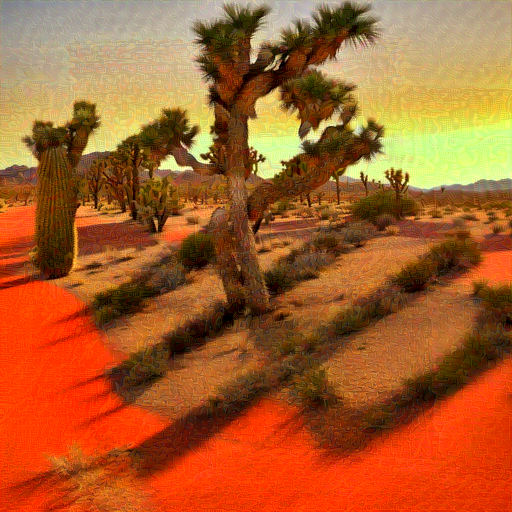

# CaptchaBench — A Modality-Stratified Benchmark for Adversarial Perturbation Against VLM-based CAPTCHA

<p align="center">
  <a href="#dataset">Dataset</a> •
  <a href="#demo">Demo</a> •
  <a href="#installation">Installation</a> •
  <a href="#usage">Usage</a> •
  <a href="#evaluation-protocol">Evaluation</a> •
  <a href="#citation">Citation</a>
</p>

This repository contains the **attack pipeline**, **VLM evaluation code**, and **analysis tools** for the CaptchaBench benchmark. We systematically evaluate six adversarial perturbation methods — organized into three *input modality groups* — as defenses against five commercial Vision-Language Models (VLMs) on Chinese character CAPTCHA images generated by dual generative pipelines (ID ControlNet + SDXL).

---

## Highlights

**Key findings** (840,000 base images · 6 attack methods · 5 VLMs · 3 metrics):

| Finding | Description |
|---------|-------------|
| **MM-1** | Image-only methods achieve high visual confusion (avg CR ≈ 98.5%) but limited text suppression |
| **MM-2** | Text-concept attacks (Nightshade) directly disrupt semantic attribution |
| **MM-3** | Multimodal joint optimization (MMCoA) maximizes cross-VLM consistency (CVC std = 0.7%) |
| **MM-4** | Gemini-3.0 exhibits a severe TVR anomaly (77–97% vs. GPT-5.2 ≤13%, GLM-4V ≤1%) |

---

## Repository Structure

```
CaptchaBench/
├── run_all_attacks.sh          # Orchestration: runs all 6 attacks in sequence
├── ATTACK_PARAMS.md            # Detailed per-method hyperparameter documentation
├── install_all_envs.sh         # One-shot conda environment setup for all methods
│
├── AdversarialAttacks/         # Glaze  — MI-FGSM / CWA transfer attack
├── Anti-DreamBooth/            # ASPL   — latent-space fine-tuning disruption
├── MMCoA/                      # MMCoA  — multimodal CLIP joint attack
├── nightshade-release/         # Nightshade — concept-level data poisoning
├── XTransferBench/             # XTransfer — ensemble super-transfer attack
├── Attack-Bard/                # AMP    — surrogate VLM transfer attack
│
├── AttackVLM/                  # VLM evaluator (test_captcha_v2.py)
│
├── scripts/                    # Paper figure reproduction scripts (23 Python scripts)
│   ├── figmm_fig1_teaser.py
│   ├── figmm_fig3_radar.py     # Modality radar charts (Fig.3 + Fig.7)
│   ├── figmm_fig4_pareto.py    # Pareto efficiency plot
│   ├── figmm_fig5_vlm_bar.py   # VLM bar charts
│   ├── figmm_fig6_stroke.py    # Stroke analysis
│   └── ...                     # See scripts/README_figure_mapping.md
│
├── figures/                    # Pre-generated paper figures (PDF)
│
└── demo/
    ├── source/                 # 3 original CAPTCHA images
    └── attacked/
        ├── mmcoa/              # MMCoA adversarial examples
        ├── amp/                # AMP adversarial examples
        ├── aspl/               # ASPL adversarial examples
        ├── xtransfer/          # XTransfer adversarial examples
        ├── nightshade/         # Nightshade adversarial examples
        └── glaze/              # Glaze adversarial examples
```

---

## Dataset

CaptchaBench is organized along three axes: **characters**, **generators**, and **perturbation methods**.

### Scale

| Component | ID-based | SDXL | Total |
|-----------|----------|------|-------|
| Chinese characters (GB2312 Level-1) | 3,500 | 3,500 | 3,500 |
| Background images | 120 | 120 | 120 |
| Base images | 420,000 | 420,000 | **840,000** |
| Attacked images (×6 methods) | 2,520,000 | 2,520,000 | **5,040,000** |

### Evaluation Subset (stratified)

| Component | Per Generator | Total |
|-----------|--------------|-------|
| Source images | 500 | 1,000 |
| Attacked images (×6) | 3,000 | 6,000 |
| VLM API calls (Q1+Q2+Q3 × 5 VLMs) | 45,000 | 90,000 |

### Dual Generative Backbones

| Pipeline | Resolution | Characteristics |
|----------|-----------|-----------------|
| **ID ControlNet** | 512×512 | Canny edge conditioning, consistent stroke topology |
| **SDXL** | 1024×1024 | Higher perceptual quality (MUSIQ: 67.4 vs 65.8), richer artistic diversity |

### Character Set

- **GB2312 Level-1**: 3,500 commonly used Chinese characters
- **Structural types**: Standalone, Left-right, Top-bottom, Enclosure
- **Stroke complexity**: 1–30+ strokes per character (annotated via Unicode Unihan `kTotalStrokes`)

### Download

> 🔗 **Dataset**: [PLACEHOLDER — Zenodo DOI]
>
> **License**: CC BY 4.0 — prohibiting commercial CAPTCHA-breaking services, unauthorized automated system access, and security-bypass applications.

---

## Demo

### How CAPTCHA images are generated

Each image is produced by the **Illusion Diffusion** pipeline: a Chinese character's stroke skeleton is used as a ControlNet conditioning map, and Stable Diffusion renders a photorealistic scene around it. The character shape is naturally embedded — visible to a careful human reader but seamlessly blended with the background.

### Source images (no perturbation)

| `captcha_1_zhan.png` | `captcha_2_pu.png` | `captcha_3_bi.png` |
|:---:|:---:|:---:|
|  |  |  |
| **蘸** (zhàn) · canyon escarpment | **蒲** (pú) · aerial rock formation | **笔** (bǐ) · desert Joshua-tree sunset |

> All three CAPTCHAs are **correctly recognized** by all five VLMs at baseline (avg CA ≈ 90.8%).

---

### Adversarial perturbations — visual comparison

The same source image `captcha_1_zhan.png` (character **蘸**) after each of the six attacks.
After attack, all five VLMs fail to recognize the character (ASR ≈ 99%).

#### 🟢 Image-only Methods

##### ASPL (Anti-DreamBooth) · ε = 0.05 in [-1, 1] space · 200 steps
> Maximizes feature deviation in **Stable Diffusion's latent encoder space** via Surrogate Prompt Learning.

| captcha\_1 | captcha\_2 | captcha\_3 |
|:---:|:---:|:---:|
|  |  |  |

##### Glaze (MI-FGSM) · ε = 16/255 · 300 steps
> Shifts the image's **style-encoder representation** toward a dissimilar target style.

| captcha\_1 | captcha\_2 | captcha\_3 |
|:---:|:---:|:---:|
|  |  |  |

##### AMP (AttackVLM) · ε = 8/255 · 300 steps
> Crafts adversarial examples against an **ensemble of open-source VLM surrogates** via PGD.

| captcha\_1 | captcha\_2 | captcha\_3 |
|:---:|:---:|:---:|
|  |  |  |

##### XTransfer · ε = 12/255 · 300 steps
> Improves black-box transferability by **summing** surrogate model logits in an ensemble of 4 CLIP models.

| captcha\_1 | captcha\_2 | captcha\_3 |
|:---:|:---:|:---:|
|  |  |  |

#### 🔵 Text-only Method

##### Nightshade · ε = 0.05 in [0, 1] space · 500 steps
> Shifts **CLIP text–image embeddings** toward a semantically unrelated target concept.

| captcha\_1 | captcha\_2 | captcha\_3 |
|:---:|:---:|:---:|
|  |  |  |

#### 🟣 Image+Text Method

##### MMCoA · ε = 1/255 in CLIP space · 100 steps
> Jointly optimizes image and text embeddings in **CLIP's shared multimodal space**. **Fastest method (2.5 s/img) and lowest perceptual distortion.**

| captcha\_1 | captcha\_2 | captcha\_3 |
|:---:|:---:|:---:|
|  |  |  |

---

### Visual distortion vs. attack effectiveness

Sorted by perceptual distortion (LPIPS, lower = cleaner):

| Method | Modality | LPIPS↓ | ASR↑ | Time/img | Visible artifact |
|--------|----------|--------|------|----------|-----------------|
| **MMCoA** | Img+Text | **0.400** | **99.5%** | 2.5 s | Nearly invisible — sub-pixel shift in CLIP space |
| AMP | Image-only | 0.431 | 99.4% | 30 s | Faint painterly smear on edges |
| XTransfer | Image-only | 0.512 | 99.1% | 20 s | Sketch-like edge outlines and crosshatch |
| ASPL | Image-only | 0.558 | 99.4% | 25 s | Fine-grained uniform noise, slightly grainy |
| Nightshade | Text-only | 0.623 | 99.0% | 94 s | Heavy impasto brushstrokes, color diffusion |
| Glaze | Image-only | 0.775 | 97.9% | 15 s | Strong oil-painting texture, most obvious |

---

## Benchmarked Methods

| Method | Paper | Venue | Input Modality | ε | Steps | Surrogate |
|--------|-------|-------|----------------|---|-------|-----------|
| ASPL | [Anti-DreamBooth](https://arxiv.org/abs/2303.15433) | ICCV 2023 | Image-only | 0.05 ([-1,1]) | 200 | SD 2.1 |
| Glaze | [MI_CommonWeakness](https://arxiv.org/abs/2303.09105) | ICLR 2024 | Image-only | 16/255 | 300 | ViT-L/14 (CLIP) |
| AMP | [AttackVLM](https://arxiv.org/abs/2305.16934) | NeurIPS 2023 | Image-only | 8/255 | 300 | BLIP / BLIP-2 |
| XTransfer | [XTransferBench](https://arxiv.org/abs/2505.05528) | ICML 2025 | Image-only | 12/255 | 300 | Ensemble ×4 |
| Nightshade | [Nightshade](https://arxiv.org/abs/2310.13828) | IEEE S&P 2024 | Text-only | 0.05 ([0,1]) | 500 | SD 2.1 |
| MMCoA | [MMCoA](https://arxiv.org/abs/2404.19287) | arXiv 2024 | Image+Text | 1/255 | 100 | ViT-B/32 (CLIP) |

All methods use **author-recommended hyperparameters**. See [`ATTACK_PARAMS.md`](ATTACK_PARAMS.md) for full parameter documentation including parameter-space conversion formulas.

---

## Evaluation Protocol

### Three-Metric Design

Each attacked image is probed with **three complementary questions**, capturing confusion at three distinct levels of VLM multimodal processing:

| Q | Metric | Prompt | What it measures |
|---|--------|--------|-----------------|
| Q1 | **CR↑** (Confusion Rate) | *Three-way forced-choice: does the image look more like source or decoy?* | Visual representation redirection |
| Q2 | **TVR↓** (Text Visibility Rate) | *"Is there a clearly readable Chinese character in this image? Yes/No."* | Text-channel suppression |
| Q3 | **ASR↑** (Attack Success Rate) | *"If this image contains a Chinese character, what is it most likely?"* | End-to-end character misrecognition |

**Cross-VLM Consistency**: CVC = std(ASR₁..₅); lower is better.

### Target VLMs

| VLM | Provider | Architecture Lineage |
|-----|----------|---------------------|
| **Qwen-VL-Max** | Alibaba | CLIP-based multimodal alignment |
| **Kimi 2.5** | Moonshot AI | Long-context vision model |
| **GPT-5.2** | OpenAI (Azure) | GPT-series vision |
| **Gemini 3.0** | Google | Gemini multimodal |
| **GLM-4V** | Zhipu AI | Bilingual GLM architecture |

All calls: `max_tokens=64`, default temperature, 10 s timeout.

---

## Installation

### Requirements
- NVIDIA GPU (RTX 3090 24 GB recommended; each method needs 4–20 GB VRAM)
- CUDA 11.8+, Anaconda / Miniconda

### Setup all conda environments
```bash
bash install_all_envs.sh
```

| Conda env | Method |
|-----------|--------|
| `adv_attack` | Glaze (MI-FGSM) |
| `anti_dreambooth` | ASPL |
| `mmcoa` | MMCoA |
| `nightshade` | Nightshade |
| `xtransfer` | XTransfer |
| `attack_bard` | AMP |
| `attackvlm` | VLM Evaluator |

### API keys (for VLM evaluation)
```bash
export AZURE_OPENAI_API_KEY="..."        # GPT-5.2
export AZURE_OPENAI_ENDPOINT="https://<resource>.openai.azure.com/"
export GOOGLE_API_KEY="..."              # Gemini 3.0
export ZHIPU_API_KEY="..."               # GLM-4V
export DASHSCOPE_API_KEY="..."           # Qwen-VL-Max
export MOONSHOT_API_KEY="..."            # Kimi 2.5
```

---

## Usage

### Step 1 — Run all attacks

```bash
# Paper-default hyperparameters (recommended for fair comparison)
bash run_all_attacks.sh \
    --source_dir /path/to/source_images \
    --target_dir /path/to/target_images \
    --match_json /path/to/match.json

# Quick sanity check: 3 images per method
bash run_all_attacks.sh \
    --source_dir /path/to/source \
    --target_dir /path/to/target \
    --match_json /path/to/match.json \
    --mini

# Unified budget for cross-method comparison
bash run_all_attacks.sh \
    --source_dir /path/to/source \
    --target_dir /path/to/target \
    --epsilon 16 --steps 300

# Skip slow SD-based methods
bash run_all_attacks.sh \
    --source_dir /path/to/source \
    --target_dir /path/to/target \
    --skip_nightshade --skip_aspl
```

Output:
```
outputs/run_full_YYYYMMDD_HHMMSS/
├── images/
│   ├── mmcoa_eps1_steps100/
│   ├── aspl_eps0.05_steps200/
│   ├── mi_eps16_steps300/          ← Glaze
│   ├── attackvlm_eps8_steps300/    ← AMP
│   ├── xtransfer_eps12_steps300/
│   └── nightshade_eps0.05_steps500/
└── log/
    ├── AttackMMCoA_eps1_steps100.log
    ├── AttackMMCoA_eps1_steps100_resource_log.txt
    └── all_resource_summary.txt    ← combined GPU/time report
```

### Step 2 — Run individual methods

```bash
# MMCoA (fastest, best quality)
conda activate mmcoa && cd MMCoA
python AttackMMCoA.py \
    --source_dir /path/to/source --target_dir /path/to/target \
    --output_dir ./out_mmcoa --epsilon 1 --num_iters 100

# Glaze / MI-FGSM
conda activate adv_attack && cd AdversarialAttacks
python AttackMI.py \
    --source_dir /path/to/source --target_dir /path/to/target \
    --output_dir ./out_glaze --epsilon 16 --steps 300

# ASPL (requires Stable Diffusion 2.1 locally)
conda activate anti_dreambooth && cd Anti-DreamBooth
python AttackASPL.py \
    --source_dir /path/to/source --target_dir /path/to/target \
    --output_dir ./out_aspl --sd_model /path/to/sd-2-1 \
    --pgd_eps 0.05 --pgd_steps 200 --pgd_alpha 0.005

# AMP — reads target character from per-image .json files
conda activate attack_bard && cd Attack-Bard
python AttackBard.py \
    --source_dir /path/to/source --output_dir ./out_amp \
    --epsilon 8 --steps 300 --use_json_text
```

### Step 3 — VLM evaluation

```bash
conda activate attackvlm
cd AttackVLM

python test_captcha_v2.py --mini_test          # 3 samples, all VLMs
python test_captcha_v2.py --num_images 50      # 50 samples
python test_captcha_v2.py --mini_test --skip_gpt   # skip GPT cost
python test_captcha_v2.py                      # full run (1,000 samples)
```

Results saved to `eval_results_v2/run_YYYYMMDD_HHMMSS/`:
- Per-image JSON with Q1/Q2/Q3 responses from all five VLMs
- `final_summary_*.json` — aggregated CR, ASR, TVR per method × VLM

---

## Hyperparameter Reference

| Method | Modality | Norm space | ε (paper default) | Steps | GPU mem | Time/img |
|--------|----------|-----------|-------------------|-------|---------|---------|
| MMCoA | Img+Text | CLIP embedding | 1/255 | 100 | ~4 GB | ~2.5 s |
| Glaze | Image-only | [-1,1] L∞ | 16/255 | 300 | ~8 GB | ~15 s |
| AMP | Image-only | [0,255] L∞ | 8/255 | 300 | ~16 GB | ~30 s |
| XTransfer | Image-only | [0,255] L∞ | 12/255 | 300 | ~8 GB | ~20 s |
| ASPL | Image-only | [-1,1] L∞ | 0.05 (≈12.75/255) | 200 | ~12 GB | ~25 s |
| Nightshade | Text-only | [0,1] L∞ | 0.05 (≈12.75/255) | 500 | ~20 GB | ~94 s |

> **Why does MMCoA use ε = 1/255?**
> MMCoA attacks the CLIP joint embedding space, not raw pixel space. In CLIP's visual–semantic representation, 1/255 pixels of perturbation produces substantial semantic drift; larger ε degrades image quality without proportional gain in ASR.

Pass `--epsilon 16 --steps 300` to `run_all_attacks.sh` for a unified cross-method comparison at the same perturbation budget.

---

## Key Results: Modality-Stratified Analysis

### The Gemini TVR Anomaly (Finding MM-4)

The most striking finding: Gemini-3.0 reports text as invisible in **77–97%** of adversarially perturbed images, while GPT-5.2 reports ≤13% and GLM-4V ≤1% — a >5× gap persisting across *all* six attack methods regardless of perturbation modality. This reveals profound VLM architectural heterogeneity in text perception that single-metric benchmarks cannot detect.

### Modality Group Comparison

| Modality Group | Methods | Avg CR↑ | Avg TVR↓ | CVC (std) |
|---------------|---------|---------|----------|-----------|
| **Image-only** | ASPL, Glaze, AMP, XTransfer | ~98.5% | Moderate | 1.2–1.6% |
| **Text-only** | Nightshade | ~97% | Low (direct semantic disruption) | ~1.0% |
| **Image+Text** | MMCoA | ~99.5% | Low | **0.7%** (best consistency) |

---

## Citation

```bibtex
@inproceedings{captchabench2026,
  title     = {CaptchaBench: A Modality-Stratified Benchmark Dataset for
               Evaluating Adversarial Perturbation Against VLM-based
               CAPTCHA Recognition},
  author    = {Anonymous},
  year      = {2026}
}
```

---

## Reproduce Paper Figures

All figures in the paper can be reproduced from the `scripts/` directory. Each script is self-contained and outputs PDF figures to `figures/`.

```bash
# Install visualization dependencies (matplotlib, numpy)
pip install matplotlib numpy

# Generate all figures
cd scripts
python figmm_fig1_teaser.py           # Fig.1  — Teaser
python figmm_fig3_radar.py            # Fig.3  — Modality radar (main) + Fig.7 (appendix)
python figmm_fig4_pareto.py           # Fig.4  — Pareto efficiency
python figmm_fig5_vlm_bar.py          # Fig.5  — VLM bar charts
python figmm_fig6_stroke.py           # Fig.6  — Stroke analysis
python figmm_fig6a_stroke_line.py     # Fig.6a — Stroke line plot
python figmm_fig6b_stroke_heatmap.py  # Fig.6b — Stroke heatmap
python figmm_fig8_vlm_bar_v2.py       # Fig.8  — VLM bar (ID/SDXL split)
python figmm_fig9a_case_kui.py        # Fig.9a — Case study (葵)
python figmm_fig9b_case_jian.py       # Fig.9b — Case study (简)
python figmm_fig10_case_study_simple.py   # Fig.10 — Case study (simple)
python figmm_fig11_case_study_stroke.py   # Fig.11 — Case study (stroke)
```

> See [`scripts/README_figure_mapping.md`](scripts/README_figure_mapping.md) for the complete figure → script mapping.

---

## License

- **Code**: MIT License
- **Dataset**: CC BY 4.0

---

## Acknowledgments

We thank the authors of [Anti-DreamBooth](https://github.com/VinAIResearch/Anti-DreamBooth), [AttackVLM](https://github.com/yunqing-me/AttackVLM), [XTransferBench](https://github.com/HanxunH/XTransferBench), [Nightshade](https://github.com/Shawn-Shan/nightshade-release), and [MMCoA](https://github.com/ElleZWQ/MMCoA) for releasing their code.
